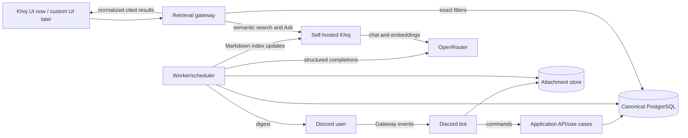
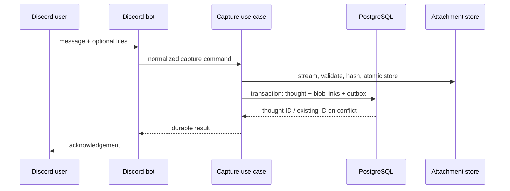

# Thought Capture AI - System Design

- **Status:** Accepted implementation anchor
- **Version:** 1.2
- **Date:** 2026-08-31
- **Audience:** Small experienced engineering team
- **Owner:** Project owner

## 1. Executive decision

Build a self-hosted personal memory system whose critical path is Discord capture, not organization. Every accepted message is written immediately to an append-only canonical log. At 20:00 in the owner's configured timezone, a background pipeline organizes new captures into an immutable daily digest and versioned, evolving entity documents, then sends the digest back through Discord.

PostgreSQL owns canonical facts, provenance, revisions, deterministic filters, and lexical search. Self-hosted Khoj owns semantic indexing, its current search/Ask interface, reranking, and RAG conversations. A first-party retrieval coordinator combines the two without modifying Khoj. A later custom web UI will call only the coordinator's stable API and will present capture history, exact search, semantic search, Ask, revisions, and operations in one interface.

This split is deliberate. Khoj currently provides semantic retrieval, cross-encoder reranking, Ask/RAG, and query filters for dates embedded in entries, include/exclude words, and files. It does not expose a stable public custom-retriever plug-in contract or the typed time, entity, source, and document-revision filters required here. Forking Khoj is explicitly not part of the baseline because it would add upgrade and AGPL source-distribution obligations. Integration remains API-based.

### 1.1 Release 1 definition of done

Release 1 is complete only when all of the following are demonstrated on a clean local installation:

- An allowlisted Discord user sends an English text message; the system durably commits it and acknowledges it within five seconds at p95 under normal local conditions.
- Redelivery of the same Discord message creates no duplicate thought.
- File and image attachments are copied to content-addressed storage and linked to the raw thought. No OCR, vision inference, or transcription occurs.
- At 20:00 local time, the worker organizes captures received since the previous successful cutoff, sends a cited daily digest to Discord, and updates relevant evolving entity documents.
- `/organize` triggers the same idempotent pipeline manually and reports its run identifier and outcome.
- Every generated claim is traceable to one or more raw thought IDs.
- Re-running a capture window creates a new run and new revisions without destroying previous output.
- Search supports semantic similarity plus exact phrase, include/exclude terms, date range, time range, source, document type, and entity filters.
- Khoj Ask answers from indexed generated documents and displays references.
- Backup, export, restore, and a model-provider failure are exercised successfully.

## 2. Problem and product goal

Conventional note systems require classification at the moment of capture: title, folder, tags, filenames, and links. That tax is paid when attention is shortest, so many thoughts are never recorded. Retrieval tools cannot recover a corpus that was never created.

The product goal is to make capture nearly effortless while moving structure, entity resolution, summarization, and indexing to a recoverable background process. The system must remain useful if every derived artifact and AI provider disappears: the raw log and attachments are the durable personal record.

### 2.1 Success measures

| Measure | Release target | Measurement |
|---|---:|---|
| Capture acknowledgement latency | p95 < 5 seconds | timestamp from Discord event receipt to acknowledgement send |
| Capture durability | zero acknowledged losses | fault-injection integration tests |
| Duplicate handling | zero duplicate rows per Discord message | uniqueness constraint and replay test |
| Daily habit | non-zero capture on at least 20 of days 31-60 | local aggregate only |
| Known-item retrieval | recall@5 >= 0.80 | owner-maintained golden query set |
| Retrieval ranking | MRR >= 0.70 | same golden set |
| Grounding | 100% generated documents have sources; >= 0.98 sampled claim support | structural check plus eval sample |
| Pipeline cost | configurable alert at USD 5/month | persisted OpenRouter usage and price snapshots |
| Recovery | RPO <= 24 hours, RTO <= 2 hours locally | quarterly restore drill |

### 2.2 Non-goals for Release 1

- Multi-user authentication, collaboration, or sharing in production.
- A custom browser UI.
- Voice capture or transcription.
- OCR, image understanding, attachment semantic indexing, or media generation.
- Automatic deletion or LLM rewriting of raw thoughts.
- Always-on screen/audio capture, wellbeing coaching, or social features.
- A public internet endpoint or mobile-native application.
- Cross-day automatic merging without an identified entity or project anchor.

## 3. Design principles

1. **Acknowledge only after durable commit.** Discord delivery is not evidence of storage.
2. **Raw means immutable.** Corrections are new events linked to old events; they are not updates.
3. **Derived means disposable but auditable.** Every derived version records run, model, prompt, and sources.
4. **Reversion is forward motion.** Restoring an older document creates a new revision whose parent is the current revision and whose content matches the selected historical revision.
5. **One stable application API.** Discord, Khoj, and the future UI are adapters around first-party use cases.
6. **Precise before impressive.** Deterministic filters and citations are requirements; chat polish is secondary.
7. **Provider isolation.** LLM, embeddings, Discord, Khoj, and storage are ports with replaceable adapters.
8. **Single-user first, workspace-scoped always.** Every domain row carries workspace ownership so later isolation and shared brains do not require re-keying the database.
9. **Local by default.** Services bind to loopback and outbound disclosure is explicit.
10. **Version external systems.** Khoj images, models, prompts, schemas, and migrations are pinned; upgrades are tested, not floated.

## 4. Scope and user experience

### 4.1 Discord capture

Release 1 supports either a direct message to the bot or messages in one configured private channel. The bot listens through the Discord Gateway and requires the `MESSAGE_CONTENT` privileged intent to receive message text and attachments outside mention-only cases. The allowlist contains the owner's Discord user ID and the configured guild/channel IDs. Messages from bots, webhooks, edits, and other users are ignored and audited without storing their content.

On a valid message:

1. Normalize Discord snowflake IDs, original Discord timestamp, content, and attachment metadata.
2. Stream each attachment to a temporary file, calculate SHA-256, verify the configured size and MIME policy, then atomically place it in content-addressed storage.
3. Insert the raw thought and attachment links in one database transaction.
4. Send a compact acknowledgement containing the thought ID. If commit fails, do not acknowledge; retry with bounded exponential backoff and alert locally.

Discord attachment URLs are signed and expire, so the worker must copy allowed attachments during ingestion. Attachments are archival only in Release 1. The absence of extracted content must be explicit in the API.

### 4.2 Daily cutoff and digest

The default cutoff is 20:00 `Asia/Bangkok`, configurable as an IANA timezone and local wall-clock time. A capture window is `(previous_successful_cutoff, current_cutoff]`, not a calendar day. This avoids losing late-evening thoughts and gives the owner one digest per operational day. Raw events still retain their true local calendar date and timezone for search.

If the machine is off at cutoff, a startup catch-up job processes every closed, unprocessed window oldest-first. A thought received after 20:00 appears in the next digest. A forced run may target the open window for testing and is labeled `provisional`; the scheduled run later supersedes its derived revisions without deleting it.

Discord receives:

- run status and capture-window times;
- a short digest designed to fit Discord message limits, split on section boundaries when needed;
- entity/project updates;
- source thought identifiers and a link to Khoj when configured;
- a clear partial/failure notice instead of an invented result.

### 4.3 Search and Ask

The system exposes one retrieval API with three modes:

- `exact`: PostgreSQL date/time/entity/type/source filters plus phrase, prefix, full-text, and trigram matching;
- `semantic`: Khoj search over exported Markdown;
- `hybrid`: both paths in parallel, normalized and fused with Reciprocal Rank Fusion (RRF).

Khoj's existing web interface is the Release 1 human interface for semantic search and Ask. The first-party `/v1/search` and `/v1/ask` contracts are the seam for a later unified UI.

### 4.4 Future unified interface

A custom UI is moderate work because it does not implement retrieval. It calls the gateway and renders a normalized model. Expected screens are Capture History, Daily Digests, Entities, Search, Ask, Revision History/Diff, Runs, and Settings. The gateway owns auth, query parsing, citations, pagination, and streaming; the browser never contacts PostgreSQL, OpenRouter, or Khoj directly.

Do not fork or visually embed Khoj as the primary plan. Use Khoj's documented HTTP APIs behind the gateway. If an endpoint is not stable, isolate it in `KhojClient` contract tests. A future upstream contribution is welcome, but no core feature depends on its acceptance.

## 5. Architecture



### 5.1 Deployable processes

| Process | Responsibility | State |
|---|---|---|
| `api` | REST gateway, health, run commands, raw/document reads, normalized search/Ask | stateless |
| `discord-bot` | Gateway connection, capture adapter, acknowledgement, slash commands, digest delivery | stateless except Discord connection |
| `worker` | persistent schedules, organization, export, Khoj sync, retries, digest dispatch | leases and run rows in PostgreSQL |
| `postgres` | canonical log, derived revisions, provenance, entities, exact search, schedules | canonical state |
| `khoj` | semantic index, reranking, Ask/RAG, current UI | regenerable index and conversations |
| `khoj-db` | Khoj-owned schema | regenerable/config state; logically isolated |
| `attachments` volume | content-addressed original files | canonical binary state |

The two databases may share one PostgreSQL server locally but must use separate databases and roles. First-party migrations never touch Khoj tables. A VPS deployment may split them without application changes.

### 5.2 Language and framework allocation

- **Python 3.14.x:** all first-party services and libraries. Pin the patch version in `.python-version` and container base image; upgrade through CI.
- **FastAPI:** HTTP transport and OpenAPI. Business rules remain framework-free.
- **Pydantic v2:** boundary validation and LLM structured-output schemas.
- **SQLAlchemy 2 async + psycopg 3:** persistence. Use explicit repository methods; no database calls from Discord event handlers outside application use cases.
- **Alembic:** first-party schema migrations, executed as a deployment step.
- **discord.py:** Discord Gateway, commands, attachments, and responses.
- **APScheduler 3.x initially:** scheduling in the worker with a PostgreSQL-backed lease. Replace with a queue only when concurrency or load justifies it.
- **pytest, Hypothesis, Ruff, mypy:** verification and quality gates.
- **Markdown:** portable generated-document interchange and Khoj indexing format.

Khoj is pinned as an OCI image. Its current source package declares Python `>=3.10,<3.13`; it must not share the first-party Python 3.14 environment.

### 5.3 Dependency direction

`domain` has no framework imports. `application` depends on domain ports. `infrastructure` implements PostgreSQL, Discord, object storage, OpenRouter, and Khoj adapters. `apps/*` wires dependencies. This hexagonal boundary is what makes Discord replaceable and permits local models later.

## 6. Canonical data model

Every table except global migration metadata carries `workspace_id`. Release 1 seeds one owner, one workspace, and one membership. This adds negligible cost now and supports two later modes: isolated personal workspaces and multi-member shared workspaces.

### 6.1 Identity and workspace

```sql
CREATE TABLE users (
  id uuid PRIMARY KEY,
  display_name text NOT NULL,
  created_at timestamptz NOT NULL DEFAULT now()
);

CREATE TABLE workspaces (
  id uuid PRIMARY KEY,
  name text NOT NULL,
  mode text NOT NULL CHECK (mode IN ('personal','shared')),
  timezone text NOT NULL,
  digest_local_time time NOT NULL DEFAULT '20:00',
  created_at timestamptz NOT NULL DEFAULT now()
);

CREATE TABLE workspace_memberships (
  workspace_id uuid NOT NULL REFERENCES workspaces(id),
  user_id uuid NOT NULL REFERENCES users(id),
  role text NOT NULL CHECK (role IN ('owner','editor','viewer')),
  PRIMARY KEY (workspace_id, user_id)
);

CREATE TABLE external_identities (
  workspace_id uuid NOT NULL REFERENCES workspaces(id),
  user_id uuid NOT NULL REFERENCES users(id),
  provider text NOT NULL,
  external_user_id text NOT NULL,
  PRIMARY KEY (provider, external_user_id),
  UNIQUE (workspace_id, user_id, provider)
);
```

### 6.2 Append-only capture layer

```sql
CREATE EXTENSION IF NOT EXISTS pg_trgm;

CREATE TABLE thoughts (
  id bigint GENERATED ALWAYS AS IDENTITY PRIMARY KEY,
  workspace_id uuid NOT NULL REFERENCES workspaces(id),
  author_user_id uuid NOT NULL REFERENCES users(id),
  source text NOT NULL CHECK (source IN ('discord','api','import')),
  source_message_id text NOT NULL,
  source_channel_id text,
  body text NOT NULL DEFAULT '',
  client_created_at timestamptz NOT NULL,
  client_timezone text NOT NULL,
  client_local_date date NOT NULL,
  client_local_time time NOT NULL,
  received_at timestamptz NOT NULL DEFAULT now(),
  content_language text NOT NULL DEFAULT 'en',
  correction_of bigint REFERENCES thoughts(id),
  body_tsv tsvector GENERATED ALWAYS AS
    (to_tsvector('english', coalesce(body,''))) STORED,
  UNIQUE (source, source_message_id)
);

CREATE INDEX thoughts_workspace_time_idx
  ON thoughts (workspace_id, client_created_at DESC);
CREATE INDEX thoughts_tsv_idx ON thoughts USING gin (body_tsv);
CREATE INDEX thoughts_trgm_idx ON thoughts USING gin (body gin_trgm_ops);

CREATE TABLE blobs (
  sha256 char(64) PRIMARY KEY,
  size_bytes bigint NOT NULL,
  media_type text NOT NULL,
  storage_key text NOT NULL UNIQUE,
  created_at timestamptz NOT NULL DEFAULT now()
);

CREATE TABLE thought_attachments (
  thought_id bigint NOT NULL REFERENCES thoughts(id),
  blob_sha256 char(64) NOT NULL REFERENCES blobs(sha256),
  source_filename text NOT NULL,
  source_url_expires_at timestamptz,
  extracted_status text NOT NULL DEFAULT 'not_supported',
  PRIMARY KEY (thought_id, blob_sha256, source_filename)
);
```

Database roles deny `UPDATE` and `DELETE` on `thoughts`; an additional trigger rejects mutation except in a restore-only administrative session. Imports and corrections append rows.

### 6.3 Runs, documents, and reversible revisions

```sql
CREATE TABLE runs (
  id uuid PRIMARY KEY,
  workspace_id uuid NOT NULL REFERENCES workspaces(id),
  kind text NOT NULL CHECK (kind IN
    ('organize','force_organize','khoj_sync','export','restore_test','reembed')),
  window_start timestamptz,
  window_end timestamptz,
  status text NOT NULL CHECK (status IN ('queued','running','succeeded','partial','failed')),
  prompt_version text,
  model_provider text,
  model_id text,
  embedding_model_id text,
  input_tokens bigint,
  output_tokens bigint,
  estimated_cost_usd numeric(12,6),
  started_at timestamptz,
  finished_at timestamptz,
  error_code text,
  error_detail text,
  created_at timestamptz NOT NULL DEFAULT now()
);

CREATE TABLE documents (
  id uuid PRIMARY KEY,
  workspace_id uuid NOT NULL REFERENCES workspaces(id),
  kind text NOT NULL CHECK (kind IN
    ('daily_digest','person','project','place','organization','topic','decision','todo')),
  stable_key text NOT NULL,
  title text NOT NULL,
  current_revision_id uuid,
  created_at timestamptz NOT NULL DEFAULT now(),
  UNIQUE (workspace_id, kind, stable_key)
);

CREATE TABLE document_revisions (
  id uuid PRIMARY KEY,
  document_id uuid NOT NULL REFERENCES documents(id),
  parent_revision_id uuid REFERENCES document_revisions(id),
  run_id uuid NOT NULL REFERENCES runs(id),
  revision_number integer NOT NULL,
  body_markdown text NOT NULL,
  body_sha256 char(64) NOT NULL,
  change_summary text NOT NULL,
  change_kind text NOT NULL CHECK (change_kind IN
    ('create','organize','manual_restore','supersede')),
  created_at timestamptz NOT NULL DEFAULT now(),
  UNIQUE (document_id, revision_number)
);

ALTER TABLE documents ADD CONSTRAINT documents_current_revision_fk
  FOREIGN KEY (current_revision_id) REFERENCES document_revisions(id);

CREATE TABLE revision_sources (
  revision_id uuid NOT NULL REFERENCES document_revisions(id),
  thought_id bigint NOT NULL REFERENCES thoughts(id),
  support_type text NOT NULL CHECK (support_type IN ('direct','context')),
  PRIMARY KEY (revision_id, thought_id)
);
```

Store full Markdown snapshots for reliable recovery. Produce unified diffs on read or cache them as non-canonical artifacts. A restore selects a historical snapshot and writes it as the next revision. Daily digest `stable_key` is the capture-window end timestamp; entity documents use normalized entity IDs.

### 6.4 Entities and mentions

```sql
CREATE TABLE entities (
  id uuid PRIMARY KEY,
  workspace_id uuid NOT NULL REFERENCES workspaces(id),
  entity_type text NOT NULL CHECK (entity_type IN
    ('person','project','place','organization','topic')),
  canonical_name text NOT NULL,
  normalized_name text NOT NULL,
  created_at timestamptz NOT NULL DEFAULT now(),
  UNIQUE (workspace_id, entity_type, normalized_name)
);

CREATE TABLE entity_aliases (
  entity_id uuid NOT NULL REFERENCES entities(id),
  alias text NOT NULL,
  normalized_alias text NOT NULL,
  PRIMARY KEY (entity_id, normalized_alias)
);

CREATE TABLE entity_mentions (
  entity_id uuid NOT NULL REFERENCES entities(id),
  thought_id bigint REFERENCES thoughts(id),
  revision_id uuid REFERENCES document_revisions(id),
  run_id uuid NOT NULL REFERENCES runs(id),
  surface_form text NOT NULL,
  confidence numeric(4,3) NOT NULL,
  CHECK ((thought_id IS NOT NULL) <> (revision_id IS NOT NULL))
);
```

Automatic alias merges are forbidden below a configurable confidence threshold. Ambiguous candidates remain separate and appear in a review queue. Release 1 may expose that queue through API only.

### 6.5 Outbox, schedules, and index state

Use a transactional outbox so a database commit and Discord acknowledgement/digest intent cannot diverge. `outbox_events` contains event type, aggregate ID, JSON payload, attempt count, lease, next attempt, and delivery timestamp. Workers use `FOR UPDATE SKIP LOCKED`.

`capture_windows` records cutoff boundaries and the successful organize run. `khoj_index_items` maps each exported Markdown filename and SHA-256 to document/revision, last synced time, and Khoj response. A revision becomes searchable only after successful index acknowledgement. `run_context_selections` (section 7.3.5) records per-run organize context assembly and is diagnostic, not canonical.

## 7. Core workflows

### 7.1 Capture sequence



If blob storage succeeds and the database transaction fails, a garbage-collection job removes unreferenced blobs after a safety interval. If attachment copy fails, the thought is not acknowledged; Release 1 treats the message as one atomic capture.

### 7.2 Organization pipeline

1. Acquire a workspace/window advisory lock.
2. Create a run row and load raw thoughts in stable timestamp/ID order.
3. Normalize Discord markup while preserving original body.
4. Assemble model context under the contract in section 7.3: the complete entity index plus selected entity-document bodies.
5. Detect candidate entities using structured model output plus existing aliases.
6. Cluster thoughts using time proximity, shared entities, and semantic hints. Release 1 may use the LLM for clustering; its output is validated and source-complete.
7. Generate the daily digest and proposed updates for touched entity documents only, as Pydantic-validated JSON. Untouched documents are not regenerated.
8. Verify every referenced thought belongs to the window/workspace and every input thought is either covered or explicitly classified `unorganized`. Record context recall for the run.
9. Write full document revisions and provenance in one transaction. Never write a partial document set after validation failure.
10. Export changed revisions to deterministic Markdown files.
11. Index changed files in Khoj and record item hashes. Failure marks the run `partial`; canonical revisions remain valid and sync retries independently.
12. Enqueue the Discord digest and mark success only after canonical commit. Discord delivery can retry without rerunning the LLM.

### 7.3 Context assembly for organization

The organize prompt must carry enough context to extend existing entity documents correctly without carrying the whole corpus. Context assembly is therefore a first-class pipeline stage with its own contract, its own invariants, and its own failure metric. It is not prompt plumbing.

Two properties of this workload set the design. First, the entity *index* is cheap and the entity *bodies* are expensive: a name, type, alias list, one-line summary, and last-mentioned date cost roughly 40 tokens per document, while a body costs 500-1500 and grows monotonically. Second, prompt caching is not a cost lever at this cadence. The longest available cache lifetime is one hour and the scheduled organize run fires once per day, so a cached corpus prefix has always expired before the next run and would incur the cache-write premium every time. Selection, not caching, is what keeps this stage affordable.

The two failure modes are asymmetric and must be treated differently:

- **Fragmentation** - the model creates a second document for an entity that already exists because it did not know the entity existed. This corrupts the corpus silently and compounds across runs. It is prevented outright by always supplying the complete index.
- **Thin detail** - the model updates a document without its full prior body. This is visible in the digest, bounded to one revision, and correctable on a later run.

Assembly buys out the first failure for a fixed, small token cost and then optimizes the second.

#### 7.3.1 Tier 1 - the complete entity index

Every organize prompt contains one index row for every entity document in the workspace, with no selection applied. A row contains the document `stable_key`, entity type, canonical name, known aliases, the document's bounded `Summary` section, the last-mentioned date, and the open-thread count.

The index is what makes entity reuse possible, so it is never truncated, sampled, or filtered. If index size ever becomes material, the response is to shorten each row, not to drop rows.

#### 7.3.2 Tier 2 - selected document bodies

Bodies are selected in two passes. The first is deterministic and free; the second is a single cheap model call.

| Signal | Source | Purpose |
|---|---|---|
| `alias` | `entities.normalized_name` and `entity_aliases`, exact and trigram matched against window text | Direct naming, including misspellings |
| `recency` | `entity_mentions` over the last `context.recency_windows` windows | Unnamed continuations of recent subjects |
| `cooccurrence` | Historical co-mention frequency with already-selected entities, above `context.cooccurrence_threshold` | Structural expansion without embeddings |
| `open_thread` | Documents of kind `todo` or `decision` with unresolved items | Standing context that is valuable whether or not it is mentioned |
| `embedding` | Cosine similarity between the window text and locally computed entity-document embeddings, top `context.embedding_top_k` | Topical relevance where the entity is neither named, recent, nor co-occurring (second wave; see 7.3.6) |
| `selector` | One `select` model call over the window text plus the Tier 1 index, returning `stable_key` values | Referential cases signals cannot resolve: pronouns, "the thing we discussed", implied projects |

The `select` call is a single request with a small structured output, not an agentic loop. It resolves most of what a tool-calling retriever would find while re-sending context once instead of once per turn, and because it is one deterministic-shaped call it stays cacheable by prompt hash for development and reproducible for evaluation.

#### 7.3.3 Generated document format

Generated entity documents use a fixed section order so that partial inclusion is well defined:

```markdown
## Summary          # bounded; source of the Tier 1 index line
## Current state    # bounded
## Open threads     # bounded
## Timeline         # append-oriented; truncatable from the tail
```

Inclusion is graded rather than binary:

| Mode | Content sent | Applies to |
|---|---|---|
| `index_only` | Tier 1 row only | Every unselected document |
| `partial` | Summary, Current state, Open threads, last `context.timeline_tail_entries` timeline entries | Marginal selections and documents over `context.max_body_tokens` |
| `full` | Entire body | High-confidence selections within budget |

Document format is a retrieval concern, not only a readability concern. Changing this section contract after the corpus exists requires regenerating documents, so it is fixed before the first organize prompt ships.

#### 7.3.4 Invariants

1. The entity index is complete. Every entity document in the workspace appears in every organize prompt.
2. Selection is additive. The final set is the union of the deterministic signals and the selector output; the selector can add documents but can never remove one that a deterministic signal produced.
3. Selector failure is non-fatal. On timeout, invalid output, or provider error, assembly proceeds with the deterministic set and the run records the degradation.
4. Expansion is bounded. If generation or validation reveals a required document that was not loaded, generation may be retried exactly once with the expanded set. There is no loop.
5. Only touched documents are regenerated. Full-snapshot revisions do not require rewriting untouched documents; those keep their current revision and no new revision row is written.
6. Assembly is recorded. Every run persists what was considered, what was selected, by which signal, and at which inclusion mode.

Invariant 2 is what makes a cheap model safe in this position: a poor selector call costs tokens, never correctness.

#### 7.3.5 Observability and context recall

```sql
CREATE TABLE run_context_selections (
  run_id uuid NOT NULL REFERENCES runs(id),
  document_id uuid NOT NULL REFERENCES documents(id),
  signals text[] NOT NULL,
  inclusion text NOT NULL CHECK (inclusion IN ('index_only','partial','full')),
  body_tokens integer NOT NULL DEFAULT 0,
  referenced_in_output boolean NOT NULL DEFAULT false,
  PRIMARY KEY (run_id, document_id)
);
```

After generation, every document referenced by the model output is marked `referenced_in_output`. This defines the stage's own quality metric:

```text
context_recall = referenced documents included as partial or full
                 / referenced documents
```

A document that was referenced while `index_only` is a retrieval miss. Without this metric an incorrect digest cannot be attributed: a selection failure and a generation failure look identical from the output alone. Target `context_recall >= 0.95`, alerting below.

#### 7.3.6 Cost envelope

| Component | Per-run input budget |
|---|---:|
| Entity index, all documents | ~2k tokens |
| Selected bodies | <= 8k tokens |
| Window thoughts | ~2k tokens |
| Instructions and schema | ~1k tokens |
| **Total input** | **<= 13k tokens** |

Once assembly is bounded this way, run cost is dominated by *output* tokens - the bodies actually rewritten - which is why invariant 5 is the largest single cost lever in the pipeline. Assembly configuration (`context.max_body_tokens`, `context.max_selected_documents`, `context.timeline_tail_entries`, `context.recency_windows`, `context.cooccurrence_threshold`, `context.embedding_enabled`, `context.embedding_top_k`) is workspace-scoped and versioned with the prompt.

Embedding selection is a planned second-wave signal, not a deferral. Entity-document embeddings are computed from each revision's `Summary` and `Current state` sections at revision-write time, inside the transaction that writes the revision, so they are fresh by construction. This is distinct from the Khoj semantic index, which covers generated documents and is by construction one run stale at organize time; organize must not depend on it, and depending on it would invert the Phase 1 / Phase 2 order.

The embedding model runs locally rather than through OpenRouter. Text embedding is inexpensive to host, and keeping it local removes per-run cost, removes a network round trip from the organize path, and avoids disclosing document content to a second provider (section 12.1). At Release 1 corpus size the vectors are stored as `float4[]` alongside the revision and compared by direct cosine similarity; pgvector is unnecessary until a linear scan is measurably expensive, and the pinned `postgres` image does not carry the extension. Changing the embedding model requires a `reembed` run and is recorded in `runs.embedding_model_id`.

Sequencing is driven by measurability, not effort. The deterministic signals and the selector call ship first so that `context_recall` has a baseline; the embedding signal is then enabled behind `context.embedding_enabled` and judged by whether that number moves. Enabling every signal at once makes an underperforming or redundant signal impossible to identify.

### 7.4 Structured output contract

```python
class ProposedDocument(BaseModel):
    stable_key: str
    kind: Literal[
        "daily_digest", "person", "project", "place",
        "organization", "topic", "decision", "todo"
    ]
    title: str = Field(min_length=1, max_length=120)
    body_markdown: str
    source_thought_ids: list[int] = Field(min_length=1)
    mentioned_entities: list[EntityMention]
    change_summary: str = Field(max_length=300)
    confidence: float = Field(ge=0, le=1)

class OrganizationResult(BaseModel):
    documents: list[ProposedDocument]
    unorganized_thought_ids: list[int]
```

The prompt forbids facts absent from sources, requires first-person voice where appropriate, resolves relative dates using each thought's timestamp/timezone, and never treats attachments as understood content in Release 1. One repair attempt may include validation errors; a second failure aborts the stage.

### 7.5 Search sequence

The request may provide structured filters directly. If it provides only natural language, the coordinator may ask a cheap model to produce a validated `QueryPlan`; the original query is always retained.

1. PostgreSQL applies workspace, date/time, entity, type, source, and lexical constraints.
2. Khoj receives the semantic query with supported date, word, and file filters appended at the end in a canonical order. This placement avoids known parser edge cases.
3. Both paths return stable document/revision/source identifiers.
4. Normalize ranks and fuse with RRF using `k=60`; exact phrase matches receive a documented deterministic boost before rank assignment.
5. Deduplicate by revision ID and return evidence snippets, scores by channel, and citations.

If Khoj is unavailable, hybrid search degrades to exact search with `degraded=true`; it never returns an empty success that implies no memory exists.

### 7.6 Ask sequence

Release 1 Ask delegates to Khoj `/notes` mode with generated Markdown indexed and query filters appended. The gateway streams the answer and normalizes references. During the first integration milestone, test whether Khoj's query-file attachment path can accept the coordinator's prefiltered evidence packet. If supported and stable, strict filters use that path. If not, strict Ask returns a clear capability code and offers exact search results; it does not silently answer from an unconstrained corpus. Direct first-party answer generation is a separately approved future ADR, not an implicit fallback.

## 8. Khoj integration contract

### 8.1 What Khoj owns

- Chunking and embedding exported Markdown.
- Semantic nearest-neighbor search.
- Optional cross-encoder reranking.
- Existing search and chat UI.
- RAG conversation flow and references.
- Conversation state owned by Khoj.

### 8.2 What Khoj does not own

- Raw thoughts, attachments, identities, entities, document revision history, schedules, provenance, exact filters, or backups.
- The canonical current version of a generated document.
- Authorization decisions for Discord or the future application UI.

### 8.3 Indexed Markdown format

Each revision export uses deterministic YAML front matter and visible ISO dates so both humans and Khoj filters can interpret it:

```markdown
---
document_id: "..."
revision_id: "..."
workspace_id: "..."
kind: "project"
stable_key: "project:thought-capture-ai"
window_start: "2026-08-29T20:00:00+07:00"
window_end: "2026-08-30T20:00:00+07:00"
entities: ["Thought Capture AI", "Khoj"]
source_thought_ids: [101, 105]
---

# Thought Capture AI

...
```

Filename: `{workspace_id}/{kind}/{stable_key_slug}--{document_id}.md`. Only the current revision is present in the live Khoj index. Historical revisions remain in PostgreSQL and portable exports, preventing Ask from citing superseded facts. Reverting changes the current file content and triggers reindex.

### 8.4 Upgrade policy

Pin Khoj by immutable image digest and record its version. Contract tests cover content batch upload/delete, search filters, result schema, chat streaming, references, and authentication. Upgrade in a branch, rebuild the index from canonical exports, run the retrieval golden set, and only then change the digest.

Khoj is AGPL-3.0-or-later. Unmodified network use through its API is operationally simpler. If the project distributes or serves a modified Khoj fork, obtain legal review and provide corresponding source as required. This document is technical guidance, not legal advice.

## 9. Retrieval model

### 9.1 Exact path

- Date and time: B-tree predicates on `client_created_at`, local date, and local time.
- Entity: join through `entity_mentions` and aliases.
- Exact phrase: escaped substring check with trigram candidate index.
- English terms: `websearch_to_tsquery('english', ...)` plus `ts_rank_cd`.
- Fuzzy spelling: trigram similarity, opt-in and thresholded.
- Filters: workspace, source, document kind, run, revision state, and provenance IDs.

### 9.2 Semantic path

Khoj initially uses its local default search models to avoid sending embeddings externally. If hardware performance is unacceptable, configure its OpenAI-compatible embedding endpoint to OpenRouter and pin an embedding model. Model changes require a full reindex; never compare vectors from different models.

### 9.3 Multilingual upgrade seam

Persist BCP-47 language tags per thought and model IDs per index generation. The English FTS configuration is selected by a mapping function, not hard-coded throughout repositories. A future migration may add language-specific generated columns or external tokenization for languages without whitespace segmentation. Embedding configuration is workspace/index-version scoped. Multilingual support therefore requires a new tokenizer/FTS strategy and a Khoj reindex, not a schema rewrite.

## 10. API contract

All first-party endpoints are under `/v1`, return RFC 9457-style problem details on errors, accept/emit UTC timestamps with offsets, and include `request_id`. Release 1 uses a local bearer token for non-Discord access. Workspace comes from authentication, never an untrusted query parameter.

| Method | Path | Purpose |
|---|---|---|
| `POST` | `/v1/thoughts` | API/import capture with `Idempotency-Key` |
| `GET` | `/v1/thoughts` | paginated raw log with exact filters |
| `GET` | `/v1/thoughts/{id}` | raw thought and archival attachment metadata |
| `POST` | `/v1/thoughts/{id}/corrections` | append a correction event |
| `GET` | `/v1/documents` | list current documents |
| `GET` | `/v1/documents/{id}` | current revision and sources |
| `GET` | `/v1/documents/{id}/revisions` | revision timeline |
| `GET` | `/v1/documents/{id}/diff` | unified diff between two revisions |
| `POST` | `/v1/documents/{id}/restore` | create a new revision from a historical revision |
| `POST` | `/v1/runs/organize` | force organization; optional window, dry-run, provisional |
| `GET` | `/v1/runs/{id}` | status, models, prompts, usage, errors |
| `GET` | `/v1/search` | exact/semantic/hybrid normalized search |
| `POST` | `/v1/ask` | streamed Khoj Ask with explicit filter capability status |
| `GET` | `/v1/entities` | entities, aliases, document links |
| `POST` | `/v1/entities/{id}/aliases` | owner-approved alias |
| `POST` | `/v1/admin/khoj-sync` | force current-document export/index sync |
| `POST` | `/v1/admin/export` | create portable plaintext export |
| `GET` | `/health/live` | process liveness only |
| `GET` | `/health/ready` | database and required dependency readiness |

`GET /v1/search` parameters include `q`, `mode`, `from`, `to`, `local_time_from`, `local_time_to`, `entity_id`, `kind`, `source`, `phrase`, `include`, `exclude`, `limit`, and opaque `cursor`. Results include `result_id`, `document_id`, `revision_id`, `thought_ids`, `title`, `snippet`, timestamps, entities, `channels` (`exact`, `semantic`), rank components, citation, and degradation state.

Discord slash commands map to use cases, not HTTP loopback calls:

- `/organize [from] [to] [dry_run]`
- `/search query`
- `/ask question`
- `/status [run_id]`
- `/undo document revision` (creates a restore revision after confirmation)

## 11. OpenRouter for a new AI developer

OpenRouter is an API gateway, not the model itself. The application sends an OpenAI-compatible HTTPS request to `https://openrouter.ai/api/v1` with an OpenRouter API key and a model slug. OpenRouter authenticates the project, routes the request to a provider that serves that model, normalizes the response, and bills the OpenRouter account. This allows model changes without replacing the SDK.

The first-party adapter uses the official OpenAI Python client pointed at OpenRouter's base URL. Configuration contains separate model IDs for `organize`, `select` (context assembly, section 7.3), `query_plan`, and optional `embedding`. Never use floating “latest” aliases in production; pin a tested slug and record the actual returned model/provider on every run.

Operational rules:

- Keep `OPENROUTER_API_KEY` only in environment/secret storage.
- Send optional app-identification headers but no personal identifier in them.
- Set explicit timeouts, retries with jitter, and a maximum token budget.
- Use structured outputs only with models verified to support the required schema behavior.
- Persist usage returned by the API and a dated price snapshot; price catalogs can change.
- Configure provider routing only after understanding whether prompts may be retained or used for training by the selected providers.
- Disable silent fallback between materially different models for organization unless the fallback model is explicitly tested.
- Cache development responses by a hash of redacted prompt, model, prompt version, and schema version; production capture content is not written to developer logs.

Model selection has two modes (ADR-0006). **Safe mode** (the default) restricts `model_organize`/`model_query_plan` to a small allowlist of slugs that have actually been checked against the three rules above - retention/training policy, tested structured-output support, and the quoted-data prompt-injection assumption in section 12.2 - enforced at process startup, not left to review discipline. **Custom mode** lifts the allowlist for an operator who wants to pin an unreviewed model and accepts that responsibility themselves. Either way, the response actually served is still checked against the requested model before its content is used (see above): safe mode prevents sending prompts to a model nobody vetted; the served-model check catches a gateway silently substituting one after the fact. These are different failures and neither guard substitutes for the other.

The embedding model is the deliberate exception to the OpenRouter default: from the organize second wave onward it runs locally (section 7.3.6), because text embedding is cheap to host, keeps the organize path free of an extra network round trip, and avoids disclosing document content to a second provider.

Local models later implement the same `LLMProvider` port through an OpenAI-compatible server such as Ollama or vLLM. Switching is configuration plus evaluation, not business-logic work.

## 12. Privacy, security, and threat model

Personal memory data is unusually sensitive: it can reveal relationships, health, location, credentials accidentally pasted into chat, routines, and future plans. “Self-hosted” protects storage location but does not make outbound Discord and OpenRouter traffic private.

### 12.1 Data disclosures

- Discord sees message content and attachments sent through Discord.
- OpenRouter and the selected downstream model provider receive text included in model requests.
- Entity-document embeddings for organize context assembly are computed locally and are not disclosed to any provider (section 7.3.6).
- If OpenRouter embeddings are enabled instead of the local model, the provider receives indexed document chunks.
- Khoj and PostgreSQL retain local copies.
- Off-site backup providers receive encrypted ciphertext only.

The settings and README must state these boundaries plainly. Release 1 has no claim of end-to-end encryption.

### 12.2 Required controls

- Allowlist exact Discord user, guild, and channel IDs; use least-privilege bot permissions.
- Enable only required Gateway intents. Do not request member or presence intents.
- Bind API, Khoj, and databases to `127.0.0.1` in local Compose.
- Use unique database roles/passwords and a non-default Khoj admin password/secret.
- Keep secrets out of Git, logs, prompts, exports, and diagnostic bundles.
- Cap attachment size, sanitize filenames for display only, store by hash, reject executable types by policy, and scan before future processing.
- Encrypt host disks where available. Encrypt off-site backups with `age`; keep the private key off the backup destination.
- Redact body text from normal logs. Log IDs, sizes, timings, hashes where necessary, and error classes.
- Require confirmation for restore, export, entity merge, and future deletion operations.
- Use constant-time bearer-token comparison and rotate credentials through a runbook.
- Protect against prompt injection from captured text by treating it as quoted data in organization prompts; tools are disabled in organization calls.

### 12.3 Retention

Default retention is indefinite for raw thoughts and attachments because recoverability is a core goal. Khoj indexes and derived exports may be deleted and rebuilt. A future deletion feature requires a separate ADR covering backups, tombstones, Discord copies, and legal expectations; it must never be introduced as a routine cleanup.

### 12.4 Future VPS controls

Use Linux, automatic security updates, a firewall exposing only 80/443, Caddy or equivalent TLS termination, Tailscale or OIDC for private admin access, rootless/non-root containers, read-only filesystems where possible, resource limits, fail2ban/rate limits, monitored backups, and no public PostgreSQL/Khoj ports. VPS deployment is prepared but not executed in Release 1.

## 13. Local deployment

Development target is Windows with WSL2 and Docker Desktop; production-like execution occurs in Linux containers. Compose services use health checks, restart policies, named volumes, and an internal network. Only the gateway and Khoj UI bind to loopback host ports.

Suggested Compose profiles:

- `core`: postgres, api, bot, worker;
- `ai`: Khoj and its database/config;
- `observability`: optional local metrics/log tooling;
- `backup`: one-shot backup and restore-test jobs.

Migrations run as a one-shot `migrate` service before app rollout, never inside API startup. The worker uses PostgreSQL advisory locks so multiple replicas cannot organize the same window. Containers run as non-root and receive only their required volumes.

Configuration groups:

- Discord: token, owner user ID, guild/channel IDs.
- Workspace: name, timezone, 20:00 cutoff.
- Database: DSN and pool sizes.
- OpenRouter: key, base URL, tested model IDs, budgets.
- Khoj: internal URL, API key, pinned digest, timeouts.
- Attachments: root, limits, allowed/blocked MIME policy.
- Retrieval: result limits, RRF constant, fuzzy threshold.

## 14. Reliability and operations

### 14.1 Failure behavior

| Failure | Required behavior |
|---|---|
| PostgreSQL unavailable at capture | no acknowledgement; retry; visible bot error if retry budget ends |
| Duplicate Discord delivery | return existing thought ID and idempotent acknowledgement |
| Attachment copy interrupted | no commit/ack; temporary file removed later |
| OpenRouter unavailable | run fails before derived commit; catch-up/manual retry |
| Invalid model JSON | one repair attempt, then fail loudly |
| Khoj unavailable | canonical documents commit; sync retries; exact search remains available |
| Discord unavailable for digest | outbox retries without rerunning organization |
| Machine off at 20:00 | catch-up windows on startup |
| Worker crash mid-run | lease expires; retry inspects run state; no partial derived transaction |
| Prompt/model changes | new versioned run; prior revisions preserved |
| Very large window | deterministic chunking with overlap and final coverage validation |

### 14.2 Observability

Use structured JSON logs with request/run IDs and OpenTelemetry-compatible traces. Metrics include capture latency/errors, outbox age, unprocessed windows, run duration/status, coverage, Khoj sync lag, search latency by channel, degraded queries, OpenRouter tokens/cost, attachment bytes, and backup age. Release 1 may expose Prometheus text metrics locally; alerts can initially be Discord owner messages with deduplication.

Never include raw bodies, generated documents, model prompts, API keys, or signed attachment URLs in logs.

### 14.3 Backup and export

- Nightly `pg_dump` after successful digest to a separate local backup directory.
- Nightly attachment manifest and incremental copy.
- Weekly encrypted off-site backup is designed but optional until a destination is selected.
- Monthly portable export: raw thoughts as timestamped Markdown/JSONL, current and historical document revisions as Markdown, provenance manifest, entities, and attachment checksums.
- Quarterly restore into scratch volumes, validate schema, row counts, foreign keys, blob hashes, and sampled documents. Record a `restore_test` run.

Backups have retention tiers (for example 14 daily, 8 weekly, 12 monthly) only after the owner approves the off-site provider and key custody plan.

## 15. Testing and evaluation

### 15.1 Test layers

- Unit: timezone/cutoff computation, normalization, idempotency decisions, revision construction, query planning, rank fusion, diff/revert behavior.
- Property: arbitrary Unicode text, timestamps around DST, repeated delivery, revision chains, and RRF invariants.
- Integration: PostgreSQL constraints/migrations/FTS, transactional outbox, attachment atomicity, OpenRouter mock server, Discord adapter fixtures.
- Khoj contract: pinned container, batch index, delete/reindex, date/word/file filters, search schema, Ask streaming, references, authentication, unavailable behavior.
- End-to-end: Discord fixture -> capture -> forced organization -> revision -> Khoj index -> search -> Ask -> digest outbox.
- Security: authorization boundaries, secret scan, dependency scan, malicious filenames, oversized uploads, prompt-injection fixtures, log-redaction checks.
- Recovery: database/blob backup and automated scratch restore.

### 15.2 Retrieval golden set

Build at least 30 owner-written questions with expected thought/document IDs and filters. Include exact names, misspellings, date-only, time-of-day, entity, semantic paraphrase, negation, superseded revisions, and “no answer” cases. CI runs deterministic exact tests; scheduled/local evaluation runs Khoj semantic recall@5 and MRR because model execution may be slower.

### 15.3 Organization evaluation

- Context recall: every entity document referenced by the output had its body supplied to the prompt, not only its index row (section 7.3.5).
- Coverage: every input thought is cited or explicitly unorganized.
- Grounding: sampled claims are supported by cited raw text.
- Temporal correctness: relative dates resolve from source timestamp/timezone.
- Revision quality: changes do not erase unsupported previous facts; conflict is represented, not silently resolved.
- Entity quality: alias precision and unresolved-candidate rate.
- Regression diff: compare the same windows across prompt/model versions.

Model or prompt promotion requires passing fixed thresholds and human review of a representative diff set.

## 16. CI/CD and engineering workflow

GitHub Actions (or equivalent) on every change:

1. secret scan and dependency metadata validation;
2. Ruff format/check;
3. mypy strict for domain/application packages;
4. pytest unit/property tests;
5. PostgreSQL integration tests with migrations from empty and previous release;
6. Khoj API contract smoke test against the pinned digest;
7. build non-root OCI images and generate an SBOM;
8. vulnerability scan with explicit severity policy.

Tags build immutable images. A later VPS pipeline backs up, runs migrations, deploys Compose, checks readiness, runs a smoke capture/search, and retains the previous image for rollback. Database rollback uses forward-fix migrations unless a tested down migration is safe; raw data is never reset.

Branches are short-lived. Any implementation that changes an accepted architecture decision adds `docs/adr/NNNN-title.md`, updates this design's decision index, and increments the design version. Prompt changes are reviewed like code.

## 17. Repository boundaries

```text
apps/api                  FastAPI routes, streaming, dependency wiring
apps/discord_bot          Discord event/command transport only
apps/worker               scheduler and outbox consumer entrypoints
packages/domain           immutable domain types, policies, ports
packages/application      capture, organize, search, ask, restore use cases
packages/infrastructure   postgres, filesystem, Discord, OpenRouter, Khoj adapters
prompts                   versioned system/user templates and JSON schemas
migrations                first-party Alembic history
deploy/compose            base, local, and future VPS overlays
tests/unit                pure logic
tests/integration         database/adapters
tests/contract/khoj       pinned Khoj behavior
tests/eval                golden retrieval and organization fixtures
docs/adr                  implementation decisions
```

No Khoj source is vendored. Generated memories, attachments, local exports, caches, databases, secrets, and rendered design intermediates are ignored by Git.

## 18. Delivery plan and gates

### Phase 0 - Repository and durable capture

Create package skeleton, Compose PostgreSQL, migrations, workspace seed, Discord adapter, attachment archive, outbox, and capture tests. Gate: replay/failure tests prove acknowledged messages are durable and deduplicated.

### Phase 0.5 - Habit validation

Use text capture for two weeks without LLM organization changes. Gate: owner still captures and friction observations are recorded. This protects against building retrieval for an unused corpus.

### Phase 1 - Organization and Discord digest

Add OpenRouter adapter, versioned prompts, runs, entity extraction, daily/entity revisions, 20:00 scheduler, `/organize`, digest outbox, and evaluation fixtures. Gate: five representative windows rerun without destructive change; coverage and grounding pass.

### Phase 2 - Khoj and hybrid retrieval

Pin self-hosted Khoj, export current Markdown, implement index sync, exact search, semantic search, RRF, Ask proxy, and contract tests. Run the strict-filter evidence-attachment spike. Gate: golden-set recall and degradation behavior pass.

### Phase 3 - Operational hardening

Add backup/export/restore drill, metrics, budgets, security tests, upgrade runbooks, and two-week unattended operation. Gate: recovery objectives and failure matrix are demonstrated.

### Phase 4 - Unified custom UI

Build the browser client against `/v1` only. Include search filters, Ask streaming/references, raw source view, revisions/diff/restore, run status, and settings. Gate: Khoj may be upgraded or temporarily unavailable without changing the UI contract; exact search remains usable.

### Phase 5 - VPS readiness and multi-user implementation

Only on owner request: choose provider, TLS/private access, monitoring, encrypted off-site backup, and deployment automation. Implement real authentication, PostgreSQL row-level security, workspace invitation/membership, per-workspace model budgets, and data export/deletion policies. Shared “hivemind” workspaces and isolated personal workspaces use the same schema.

## 19. Accepted decisions and deferred decisions

### Accepted

- Discord replaces Telegram as the first capture surface.
- Single-user operation with workspace-scoped schema.
- Raw log and original attachments are append-only canonical data.
- PostgreSQL handles precision retrieval; Khoj handles semantic retrieval and Ask.
- Khoj is self-hosted, pinned, API-integrated, and not forked.
- First-party services use Python 3.14; Khoj remains runtime-isolated.
- OpenRouter is the initial LLM gateway; local models remain a compatible future adapter.
- Daily digest cutoff defaults to 20:00 local, using successful-cutoff capture windows.
- Entity documents evolve through immutable full-snapshot revisions.
- Khoj UI is used first; a unified custom UI is Phase 4.
- Organize context is assembled from a complete entity index plus additive body selection, with locally computed embeddings as a second-wave signal.

### Deferred with explicit trigger

- Exact model slugs: select during implementation by a small structured-output evaluation and budget check.
- Off-site backup provider: select before VPS or after one month of valued data, whichever comes first.
- Strict-filter Ask evidence injection: resolve during Khoj contract spike; never silently weaken filters.
- OCR/vision/transcription: new release only after capture habit validation.
- Entity merge across weak aliases: require review workflow and quality data.
- Cross-day non-entity rolling documents: evaluate after entity documents are used.
- Agentic tool-calling retrieval in the organize pipeline: reconsider only when the complete entity index no longer fits the prompt budget, in the high hundreds of entity documents. Below that threshold the index is already fully visible to the model, while a loop costs roughly 2.5-5x the assembly input tokens and makes the section 15.3 regression diffs non-reproducible.
- Public or multi-user access: requires Phase 5 security gate.

## 20. Initial ADR index

| ADR | Decision |
|---|---|
| ADR-0001 | Append-only canonical event log |
| ADR-0002 | Discord Gateway as capture adapter |
| ADR-0003 | PostgreSQL precision retrieval plus Khoj semantic/Ask |
| ADR-0004 | Immutable full-snapshot document revisions |
| ADR-0005 | Workspace-scoped single-user-first schema |
| ADR-0006 | OpenRouter behind a provider port, with safe and custom model-selection modes |
| ADR-0007 | Custom unified UI over stable gateway, no Khoj fork |

Implementation should create these ADR files when the first code for each decision lands; this design remains the summary authority.

## 21. References verified 2026-08-30

- Khoj query filters (word, date, and file): https://docs.khoj.dev/miscellaneous/query-filters/
- Khoj semantic search and configurable local/OpenAI-compatible models: https://docs.khoj.dev/features/search/
- Khoj Ask/RAG behavior and references: https://docs.khoj.dev/features/chat/
- Khoj self-hosting: https://docs.khoj.dev/get-started/setup/
- Khoj source/package compatibility and AGPL license: https://github.com/khoj-ai/khoj
- Discord Gateway and privileged message-content intent: https://docs.discord.com/developers/events/gateway
- Discord message/attachment behavior: https://docs.discord.com/developers/resources/message
- OpenRouter OpenAI-compatible quickstart: https://openrouter.ai/docs/quickstart
- OpenRouter embeddings endpoint: https://openrouter.ai/docs/api/api-reference/embeddings/create-embeddings
- Python 3.14.7 release: https://www.python.org/downloads/release/python-3147/

## Appendix A - Release 1 acceptance checklist

- [ ] Fresh clone starts with documented commands and no manually created database objects.
- [ ] Secrets are supplied externally and secret scanning passes.
- [ ] Unauthorized Discord content is neither stored nor acknowledged.
- [ ] Text and allowed attachments survive process termination after acknowledgement.
- [ ] Duplicate Discord events return the existing thought.
- [ ] 20:00 cutoff and DST tests pass for at least Bangkok and London.
- [ ] Catch-up produces exactly one canonical result per closed window.
- [ ] `/organize` dry run writes no derived revisions.
- [ ] Every revision has run, parent, checksum, change summary, and thought sources.
- [ ] Restore creates a new revision and preserves the full chain.
- [ ] Exact search covers every documented filter.
- [ ] Hybrid search exposes channel scores and degraded state.
- [ ] Khoj index contains current revisions only.
- [ ] Ask references resolve to current documents and raw sources.
- [ ] Strict filters are either honored or rejected explicitly.
- [ ] OpenRouter failure, timeout, invalid JSON, and budget limit are tested.
- [ ] Logs contain no raw thought bodies, tokens, or signed URLs.
- [ ] Backup/export restore succeeds in scratch volumes.
- [ ] Golden retrieval thresholds and organization evaluation gates pass.

## Appendix B - Definition of a safe change

A change is safe when raw data remains readable, existing revisions remain reachable, migrations work from every supported release, current Markdown can be rebuilt deterministically, Khoj can be reindexed from that export, API compatibility is preserved or versioned, and the relevant failure/recovery test passes. If any condition is unknown, the change is not ready to merge.

